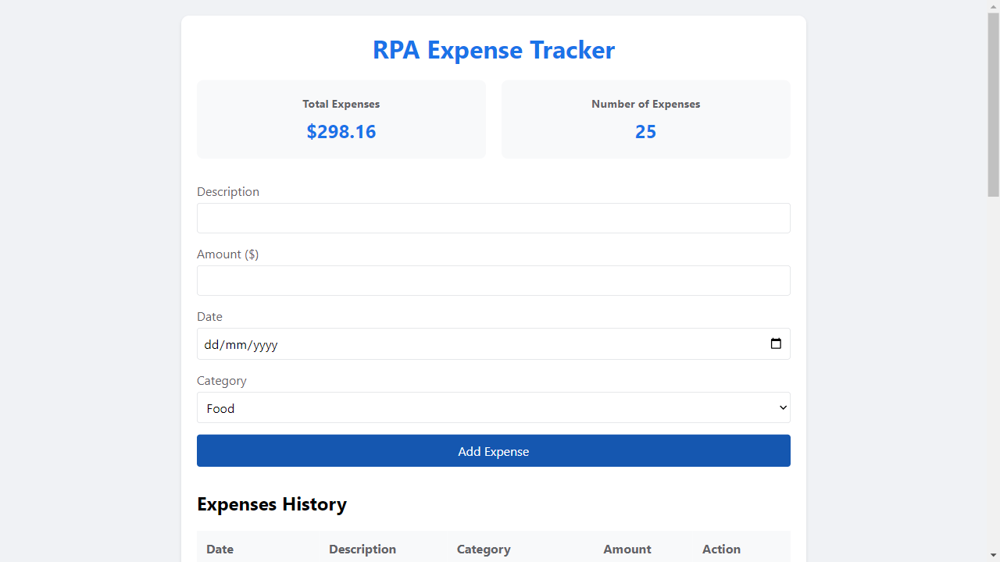

# RPA-Expense-Tracker
*Final Output*

  

**1. Overview:**

The RPA (Robotic Process Automation) Expense Tracker aims to streamline the process of transferring expense data from a note-taking application (e.g., Notion, OneNote, Google Keep) to an expense-tracking website (e.g., Google Sheets, Expense Manager platforms). This project leverages RPA to automate repetitive tasks, reducing human error and saving time.

**2. Explanation:**

A person often records their daily expenses in a note-taking app for convenience. However, when they want to consolidate this data into a structured format on a website, it becomes a tedious, repetitive task. 

*The RPA Expense Tracker automates this process by:*

- Extracting Expense Data: Parsing the expense information from the note-taking app.
- Processing the Data: Formatting and organizing the extracted data for compatibility with the target website.
- Filling the Website: Automating the login, navigation, and data entry into the desired platform.
The solution ensures efficiency, accuracy, and convenience, removing the burden of manual data entry.

**3. Objectives:**
- Automate Data Transfer:

Extract expense data from a chosen note-taking app.
Identify and process text into structured categories (e.g., date, amount, category, description).

- Data Structuring and Validation:

Validate and clean data before entering it into the target website.
Handle duplicates, missing entries, or incorrect formatting.

- Seamless Website Integration:

Automate the login and navigation process on the expense-tracking website.
Ensure secure handling of credentials using encryption.

- Error Handling:

Implement robust mechanisms to detect and manage errors during automation (e.g., failed logins, format mismatches).

- User-Friendly Design:

Provide a simple interface for the user to:
Select the source (note-taking app).
Define the target (expense website).
View logs and summaries of automated tasks.

- Scalability:

Allow future integration with additional note-taking apps or expense-tracking websites.

**4. Key Components of the Project**

- Data Extraction:
Use APIs or OCR (Optical Character Recognition) to extract text from the note-taking app.

- Data Processing:
Parse raw text into meaningful data fields:
Date: Identify expense dates.
Amount: Detect and validate currency values.
Category: Assign categories (e.g., Food, Travel, Miscellaneous).
Description: Extract detailed notes.

- RPA Workflow:
Use RPA tools (e.g., UiPath, Automation Anywhere, or Python-based frameworks like Selenium and PyAutoGUI) to:
Automate login to the expense website.
Navigate the UI to add new entries.
Input structured data into the respective fields.

- Logging and Monitoring:
Keep a detailed log of automation actions (e.g., successful entries, errors).
Provide a summary of completed tasks.

**5. Benefits of the RPA Expense Tracker**
- Time-Saving: Eliminates repetitive manual entry tasks.

- Accuracy: Reduces human error during data transfer.

- Ease of Use: Simplifies expense management for non-technical users.

- Scalability: Can be extended to work with multiple platforms and workflows.

**6. Potential Use Cases**
- Individual Users: Automate daily or weekly expense logging into personal finance tools.

- Small Businesses: Streamline expense reporting from informal records to accounting software.

- Freelancers: Manage expense claims more efficiently for tax or reimbursement purposes.

